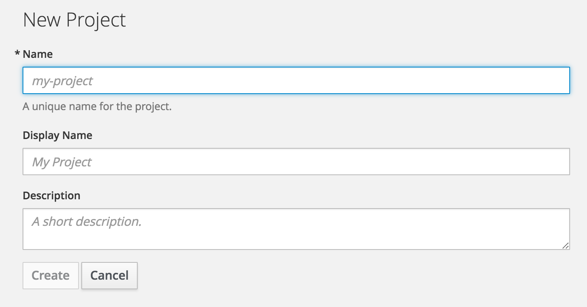
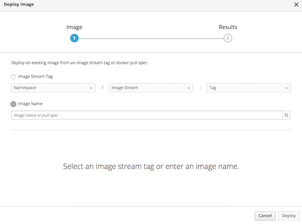

[[create-an-app-from-a-docker-image]]
Create an App from a Docker image
~~~~~~~~~~~~~~~~~~~~~~~~~~~~~~~~~

In this lab you will learn how to create a new project on OpenShift and
how to create an application from an existing docker image using Web UI.

*Step 1: Add a new project from command line*

IMPORTANT: Please replace *username* with your username

- login to web UI via https://master.ocp.tauil.org
- Use the same username and password that assigned to you
- Click "New Project"

- Enter project name (all lower case) as myproject-*username* and other information

- Click create button

*Step 2: Create an application from a Docker Image*

- Once you created a new project, we will see this page

image::images/add-project.png[image]

- Click on "Deploy Image" tab
- Select "Image Name" radio button

- Enter the name of the container image under Image Name as
redhatworkshops/welcome-php
- Click on search

image::images/search.png[image]

- Enter a Name for the deploy

image:images/image-details.png[image]

- Click create

Congratulations!! You now know how to create a project, an application
using an external docker image and navigate around. Get ready for more
fun stuff!
